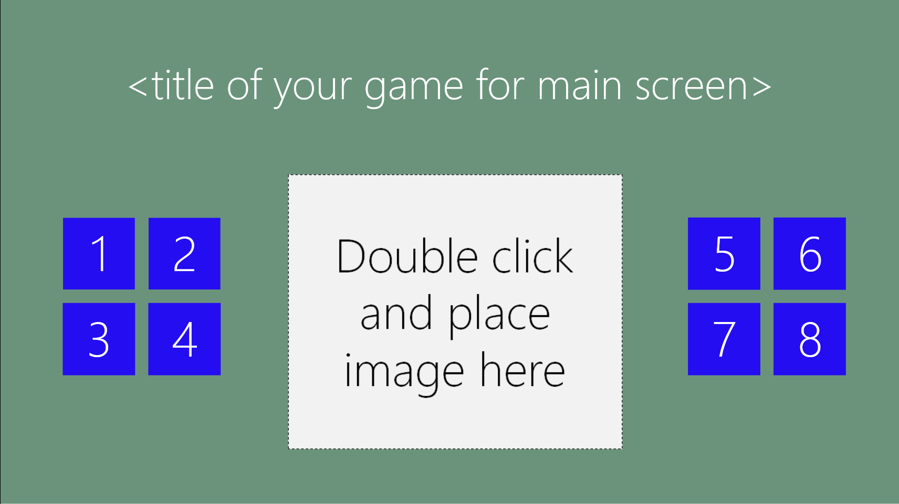
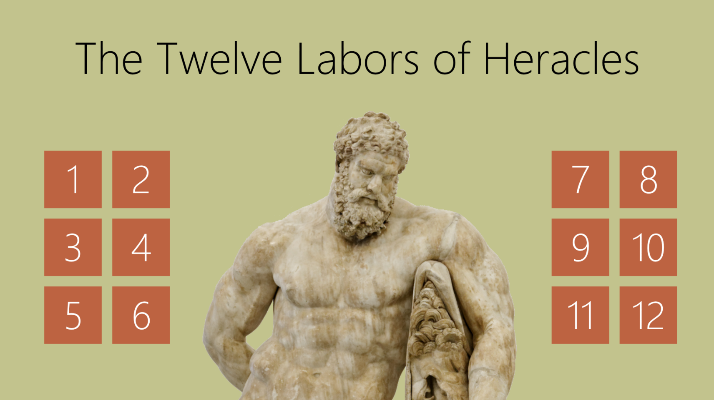

#Eight Facts Starter KIt

##Author(s): Jim O'Neil
##Date: 9.16.2013
##Version: v1.0.0
##Author(s): Jim O'Neil
##URL: https://github.com/wingamekits/EightFacts

----------
###Description

The Eight Facts Starter is a Construct 2 game template is a simple educational app template for which you provide a theme that has eight interesting facts. You supply an image, a short fact title and a fact narrative (the latter two in an XML file that's part of the project).

###Requirements

 - Windows 8
 - [Visual Studio 2012 Express for Windows 8][1] or higher
 - [Construct 2][1] free edition
 
**Note: this template is optimized for Windows 8. Updates are planned to improve the experience for both Windows 8.1 and Windows Phone 8** 

###Setup and Customization
 - Download the starter kit ZIP file and extract its contents
 - Open the *EightFacts.capx* file in Construct 2
 - Follow the customization steps in the *CustomizeGameHere* event sheet
 - Add further features to the application via the *FactPgeEvents* and *MainScreenEvents* sheet
 - Consult the [store publication PDF document] for the steps to submit to the Windows Store
 
[1]:http://www.microsoft.com/visualstudio/eng/products/visual-studio-express-for-windows-8 "Visual Studio 2012 Express for Windows 8"
[2]:http://scirra.com/construct2
[3]:https://github.com/jimoneil/Construct-2/blob/master/Scirra2Store.pdf?raw=true
